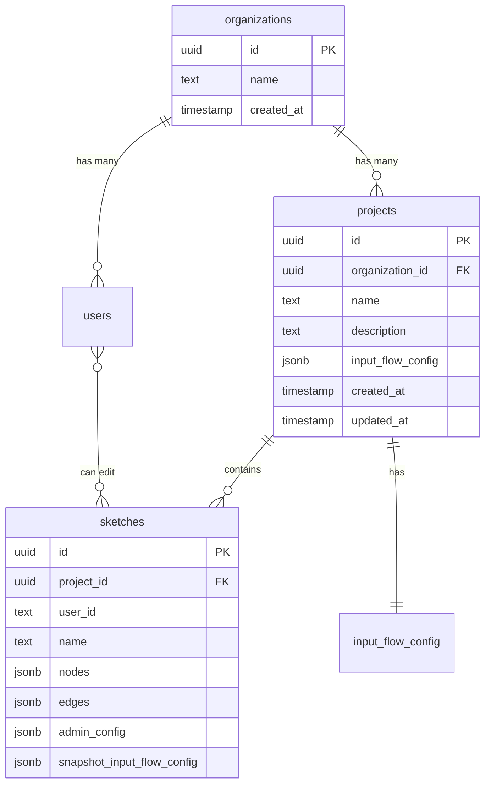
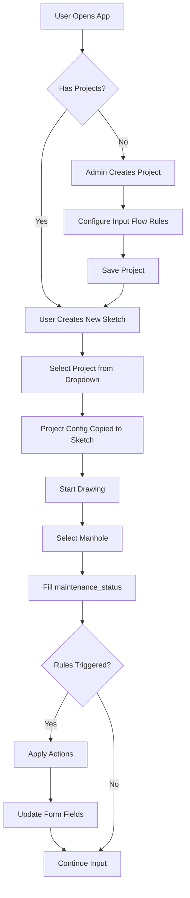

# Intelligent Input Flow System - Artist/Developer Vision

## Vision Overview

Transform the manholes/pipes data input experience from a static form to an **intelligent, context-aware input system** that adapts based on field values, reducing errors and improving field worker efficiency.

---

## Architecture




---

## Input Flow Configuration Structure

The `input_flow_config` JSON stored per project defines conditional rules:

```json
{
  "version": "1.0",
  "nodes": {
    "rules": [
      {
        "id": "schematic_bulk_reset",
        "trigger": { "field": "accuracy_level", "operator": "equals", "value": 1 },
        "actions": [
          { "type": "bulk_reset", "fields": ["maintenance_status", "cover_diameter", "material", "access"] }
        ]
      },
      {
        "id": "cannot_open_nullify",
        "trigger": { "field": "maintenance_status", "operator": "equals", "value": 3 },
        "actions": [
          { "type": "nullify", "field": "cover_diameter" },
          { "type": "disable", "field": "access" },
          { "type": "disable", "field": "material" }
        ]
      },
      {
        "id": "covered_manhole_require",
        "trigger": { "field": "maintenance_status", "operator": "equals", "value": 4 },
        "actions": [
          { "type": "require", "field": "notes" }
        ]
      }
    ]
  },
  "edges": {
    "rules": [
      {
        "id": "drainage_line_defaults",
        "trigger": { "field": "edge_type", "operator": "equals", "value": 4802 },
        "actions": [
          { "type": "nullify", "field": "fall_depth" }
        ]
      }
    ]
  }
}
```

**Action Types:**

- `nullify`: Set field value to NULL/empty
- `disable`: Hide field from input form
- `require`: Make field mandatory
- `bulk_reset`: Reset multiple fields to their defaults

---

## Key Components

### 1. Database Schema Changes

**New `projects` table** in `[api/_lib/schema.sql](api/_lib/schema.sql)`:

```sql
CREATE TABLE IF NOT EXISTS projects (
    id UUID PRIMARY KEY DEFAULT gen_random_uuid(),
    organization_id UUID NOT NULL REFERENCES organizations(id) ON DELETE CASCADE,
    name TEXT NOT NULL,
    description TEXT,
    input_flow_config JSONB DEFAULT '{}'::jsonb,
    created_at TIMESTAMPTZ DEFAULT NOW(),
    updated_at TIMESTAMPTZ DEFAULT NOW()
);

-- Migration for sketches
ALTER TABLE sketches ADD COLUMN IF NOT EXISTS project_id UUID REFERENCES projects(id);
ALTER TABLE sketches ADD COLUMN IF NOT EXISTS snapshot_input_flow_config JSONB DEFAULT '{}'::jsonb;
```

### 2. API Endpoints

New routes in `api/projects/`:

- `GET /api/projects` - List projects for user's organization
- `POST /api/projects` - Create project (org admin/super admin)
- `GET /api/projects/[id]` - Get project details
- `PUT /api/projects/[id]` - Update project (including input_flow_config)
- `DELETE /api/projects/[id]` - Delete project
- `POST /api/projects/[id]/duplicate` - Duplicate project with config

### 3. Frontend Pages

**New route: `#/projects**` - Project Management:

- List organization projects
- Create/edit project name & description
- Navigate to input flow configuration

**New route: `#/projects/[id]/input-flow**` - Business Input Flow Configuration:

- Visual rule builder UI
- Import/Export JSON buttons
- Preview of how fields behave
- Separate tabs for Nodes and Edges

### 4. Smart Input Form Enhancement

Modify `[src/legacy/main.js](src/legacy/main.js)` `renderDetails()` function to:

1. Load active project's input_flow_config (or sketch's snapshot)
2. Evaluate rules on every field change
3. Apply actions: hide fields, clear values, show required indicators
4. Re-render form dynamically

---

## User Flow




---

## File Changes Summary

| File | Changes |

|------|---------|

| `api/_lib/schema.sql` | Add projects table, sketch columns |

| `api/_lib/db.js` | Add project CRUD functions |

| `api/projects/index.js` | New: List/Create projects |

| `api/projects/[id].js` | New: Get/Update/Delete project |

| `api/sketches/index.js` | Require project_id, copy config |

| `src/legacy/main.js` | Add project selection, rule engine |

| `src/state/constants.js` | Add default input flow rules |

| `src/admin/input-flow-settings.js` | New: Rule builder UI |

| `index.html` | Add project routes, UI elements |

| `AI_CATALOG.MD` | Update routing documentation |

---

## Input Flow Settings UI Design

The Business Input Flow configuration page will have:

1. **Header Section**
  - Project name (editable)
  - Import/Export JSON buttons
2. **Tabs**: Nodes | Edges
3. **Rules List** (for each tab)
  - Each rule displayed as a card
  - Trigger: "When [field] [operator] [value]"
  - Actions list with type badges
  - Add/Edit/Delete rule buttons
4. **Rule Editor Modal**
  - Field dropdown (from constants)
  - Operator dropdown (equals, not_equals, empty, not_empty)
  - Value input (dynamic based on field type)
  - Actions builder (add multiple actions)

---

## Default Rules (Pre-configured)

These rules ship by default and can be modified per project:

**Nodes:**

- `accuracy_level = סכימטית (1)` → Bulk reset all other fields
- `maintenance_status = לא ניתן לפתיחה (3)` → Nullify diameter, disable access/material
- `maintenance_status = שוחה מכוסה (4)` → Require notes field

**Edges:**

- `edge_type = קו סניקה (4802)` → Different default behaviors

---

## Security Considerations

- Only Org Admin + Super Admin can modify projects/input flow
- Regular users see project list but cannot edit
- Sketch stores snapshot of config to prevent retroactive changes
- API validates

