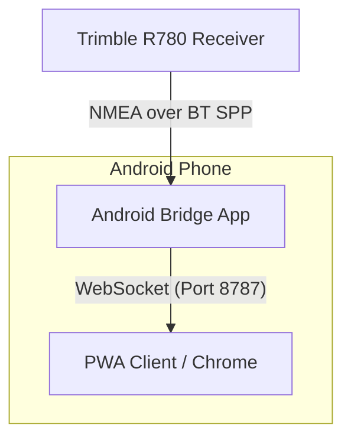

# GNSS Bridge Solution

This solution bridges NMEA data from a Trimble R780 (or any Bluetooth SPP GNSS receiver) to a web application (PWA) running on the same Android device.

## Components

1.  **Android Bridge App**: A Kotlin app that connects to the receiver via Bluetooth SPP and runs a WebSocket server on port 8787.
2.  **PWA Client**: A React-based web app that connects to `ws://127.0.0.1:8787` to display real-time positioning data.

## Setup Instructions

### 1. Pair the Trimble R780
- Turn on the Trimble R780.
- On your Android device, go to **Bluetooth Settings**.
- Pair with the R780 (it usually appears as "R780 - [Serial Number]").
- Ensure NMEA output is enabled on the receiver (usually via the Trimble Web UI or a configuration tool like Trimble Mobile Manager). It should be set to output GGA and RMC sentences over Bluetooth.

### 2. Build and Run the Android Bridge
- Open the `/android-bridge` folder in **Android Studio**.
- Build and install the app on your Android device.
- Open the app and grant the required permissions (Bluetooth, Location, Notifications).
- Select the paired R780 from the list and tap **Connect**.
- You should see the "BT Status" change to `connected` and NMEA lines appearing in the preview.

### 3. Run the PWA Client
- Navigate to the `/pwa-client` folder in your terminal.
- Run `npm install` to install dependencies.
- Run `npm run dev` to start the development server.
- Open the provided URL (e.g., `http://localhost:3000`) in **Chrome on the same Android device**.
- The PWA will automatically attempt to connect to the local WebSocket server.
- Once connected, you will see the live GNSS dashboard updating.

## Troubleshooting

- **WebSocket Connection Failed**: Ensure the Android app is running and the "WS Clients" count reflects your connection. Note that if you serve the PWA over `https`, Chrome might block `ws://` connections. In development, use `http://[IP]:3000`.
- **Bluetooth Permissions**: On Android 12+, ensure "Nearby Devices" permission is granted.
- **Trimble NMEA**: If no data appears, verify the R780 is configured to send NMEA sentences (specifically GGA and RMC) over its Bluetooth port.
- **Simulation Mode**: Use the "Enable Simulation Mode" checkbox in the Android app to test the PWA without a physical receiver.

## Architecture

