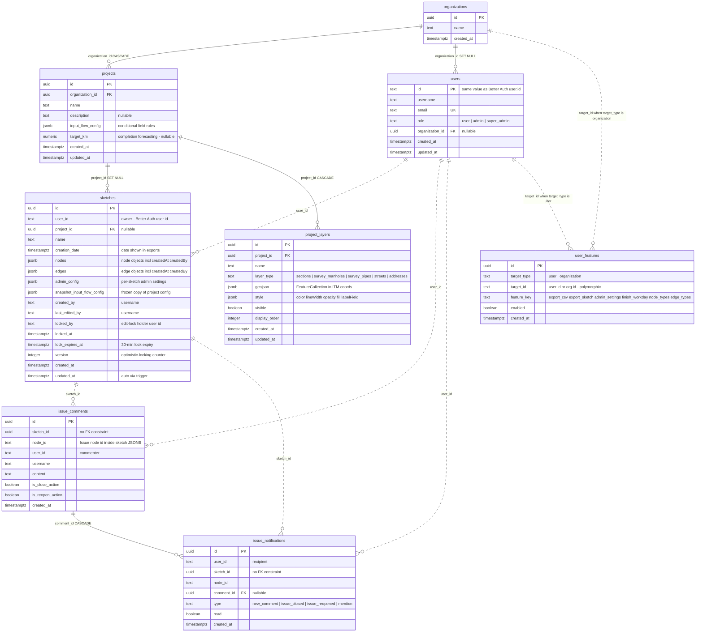
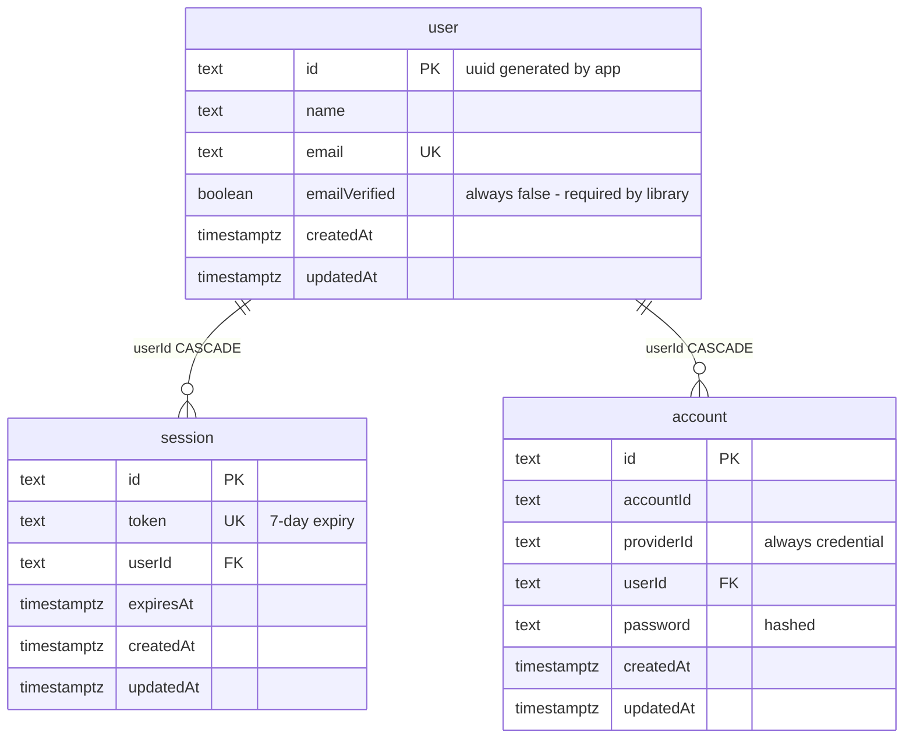

# Database ERD — Manholes Mapper

Entity-relationship diagram of the tables **actually used** by the app (Neon Postgres).
Source of truth: `api/_lib/db.js` (`initializeDatabase()`) + `scripts/migrate-auth-tables.js` (Better Auth).
Unused tables and fields have been removed from this diagram — see [Removed / excluded items](#removed--excluded-items) at the bottom.

Solid lines = real foreign-key constraints. Dashed lines = logical joins (no FK constraint in the DB).

## Application tables

## Better Auth tables

Managed by the Better Auth library (email/password only, no OAuth, no email verification).
`users.id` (app table above) stores the same value as `user.id`.

## Removed / excluded items

Tables and fields that exist in the schema/scripts but are **not used** by the app, and are therefore left out of the diagrams above:

| Item | Why it's unused | Can it be dropped? |
|------|-----------------|--------------------|
| `rate_limits` table | Only created/used by `checkDbRateLimit()` in `api/_lib/rate-limit.js`, which is never called by any route (all routes use the in-memory limiter). Also flagged in `docs/SECURITY-AUDIT-2026-04-20.md`. | Yes — safe to drop, plus the dead `checkDbRateLimit()` code. |
| `verification` table | Better Auth email-verification/reset storage; `requireEmailVerification: false` and no reset flow, so it stays empty. | No — Better Auth requires the table to exist. Keep, but it holds no data. |
| `account.accessToken`, `refreshToken`, `idToken`, `accessTokenExpiresAt`, `refreshTokenExpiresAt`, `scope` | OAuth-only fields; the app uses email/password (`providerId = 'credential'`) exclusively. | Risky — Better Auth's schema expects them; dropping may break inserts. Keep in DB, ignore. |
| `user.image` | No avatar feature; never read anywhere in the frontend. | Same as above — part of Better Auth's core schema. |
| `session.ipAddress`, `session.userAgent` | Written by Better Auth on sign-in but never read by the app. | Same as above. |
| `sketch_locks` table | **Does not exist.** Mentioned in `CLAUDE.md` docs, but locking is implemented as `locked_by` / `locked_at` / `lock_expires_at` columns on `sketches`. | Documentation fix only. |

### Note on stale `api/_lib/schema.sql`

`api/_lib/schema.sql` has drifted from the runtime schema in `db.js`: it declares `sketches.user_id` and `users.id` as `UUID` (runtime uses `TEXT`), and is missing the lock columns, `version`, `projects.target_km`, `issue_comments`, and `issue_notifications`. The runtime `initializeDatabase()` in `api/_lib/db.js` is authoritative.
